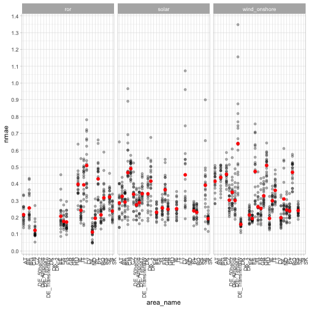

## Plotting the errors
This script reads the errors computed by `02_compute_errors.R` and prepare
a plot.


```r
library(tidyverse)
```

The target data is in `BASE_PATH` and the `NUTS_LEVEL` sets the level
of spatial aggregation for the predictors (meteorological data from ERA-NUTS)


```r
BASE_PATH <- "ts_prod/"
NUTS_LEVEL <- "NUTS0"
```

The script `get_file_list.R` loads the list of the target files
with a set of metadata for each of them


```r
source("get_file_list.R")
file_list <- get_file_list()
```

```
## Parsed with column specification:
## cols(
##   area_name = col_character(),
##   country = col_character(),
##   source = col_character(),
##   active = col_double(),
##   filename = col_character()
## )
```

```
## Joining, by = c("area_name", "country", "source", "active", "filename")
```

```r
print(head(file_list))
```

```
## # A tibble: 6 x 10
##   area_name country source  active filename    max   q95 median   avg   nas
##   <chr>     <chr>   <chr>    <dbl> <chr>     <dbl> <dbl>  <dbl> <dbl> <int>
## 1 AT        AT      ror          1 AT_ror.… 11419. 4604  2.75e3 2846.     0
## 2 AT        AT      solar        1 AT_sola…   886   468  1.30e1  115.     0
## 3 AT        AT      wind_o…      1 AT_wind…  2662  1527  2.60e2  439.     0
## 4 BE        BE      solar        1 BE_sola…  2620. 1595. 5.47e0  335.     0
## 5 BG        BG      ror          1 BG_ror.…   367   333  1.44e2  167.     0
## 6 BG        BG      solar        1 BG_sola…   856   658  3.00e0  150.     0
```

Read the errors


```r
errors <- read_rds(sprintf("errors-%s.rds", NUTS_LEVEL))
```

A list containing all the data needed for the plot extracted by
the list with errors


```r
data_for_plot <- list()
for (i in seq(1, length(errors))) {
  #' Get the medatata for the i-th filename
  metadata <- file_list %>%
    filter(filename == errors[[i]]$filename)
  if (nrow(metadata) == 0) {
    warning("The error-data with index ", i, " is not in the filelist")
  } else {
    data_for_plot[[i]] <- tibble(
      area_name = metadata$area_name,
      source = metadata$source,
      nmae = errors[[i]]$cv_nmae,
      k = seq(1, length(errors[[i]]$cv_nmae))
    )
  }
}

## SAVE RDS --------------------------------------------------------
```

Save the data for the plot as a RDS


```r
write_rds(data_for_plot, sprintf("errors-summary-%s.rds", NUTS_LEVEL))

## PLOT ------------------------------------------------------------
```

Prepare the ggplot plot


```r
g <- ggplot(data_for_plot %>% bind_rows()) +
  geom_point(aes(x = area_name, y = nmae), alpha = 0.3) +
  geom_point(
    data = data_for_plot %>%
      bind_rows() %>%
      group_by(area_name, source) %>%
      summarise(avg_nmae = mean(nmae)),
    aes(x = area_name, y = avg_nmae),
    color = "red", size = 2
  ) +
  scale_y_continuous(breaks = seq(0, 2, 0.1)) +
  facet_wrap(~source) +
  theme_light() +
  theme(axis.text.x = element_text(angle = 90, hjust = 1))
ggsave(filename = sprintf("errors-summary-%s.png", NUTS_LEVEL), width = 9, height = 4)

print(g)
```



