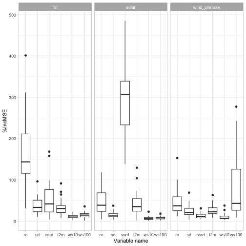

## Importance analysis
This script carries out an analysis on the importance of the
predictos used by the random forests


```r
library(tidyverse)
library(randomForest)
```

The target data is in `BASE_PATH` and the `NUTS_LEVEL` sets the level
of spatial aggregation for the predictors (meteorological data from ERA-NUTS)


```r
BASE_PATH <- "ts_prod/"
NUTS_LEVEL <- "NUTS0"
```

The script `get_file_list.R` loads the list of the target files
with a set of metadata for each of them


```r
source("get_file_list.R")
file_list <- get_file_list()
```

```
## Parsed with column specification:
## cols(
##   area_name = col_character(),
##   country = col_character(),
##   source = col_character(),
##   active = col_double(),
##   filename = col_character()
## )
```

```
## Joining, by = c("area_name", "country", "source", "active", "filename")
```

```r
print(head(file_list))
```

```
## # A tibble: 6 x 10
##   area_name country source  active filename    max   q95 median   avg   nas
##   <chr>     <chr>   <chr>    <dbl> <chr>     <dbl> <dbl>  <dbl> <dbl> <int>
## 1 AT        AT      ror          1 AT_ror.… 11419. 4604  2.75e3 2846.     0
## 2 AT        AT      solar        1 AT_sola…   886   468  1.30e1  115.     0
## 3 AT        AT      wind_o…      1 AT_wind…  2662  1527  2.60e2  439.     0
## 4 BE        BE      solar        1 BE_sola…  2620. 1595. 5.47e0  335.     0
## 5 BG        BG      ror          1 BG_ror.…   367   333  1.44e2  167.     0
## 6 BG        BG      solar        1 BG_sola…   856   658  3.00e0  150.     0
```

Read the errors computed by `02_compute_errors.R`


```r
errors <- read_rds(sprintf("errors-%s.rds", NUTS_LEVEL))
```

Storing here the importance data


```r
importance_data <- list()

for (i in seq(1, length(errors))) {
  
  #' Get the medatata for the i-th filename
  metadata <- file_list %>%
    filter(filename == errors[[i]]$filename)
  
  if (nrow(metadata) == 0) {
    warning("The error-data with index ", i, " is not in the filelist")
  } else {
    importance_data[[i]] <- importance(errors[[i]]$single_model) %>%
      as_tibble(rownames = "varname") %>%
      select(varname, `%IncMSE`) %>%
      separate(varname, into = c("varbasename", "areaname"), sep = "_") %>%
      group_by(varbasename) %>%
      summarise(`%IncMSE` = mean(`%IncMSE`)) %>%
      mutate(
        filename = metadata$filename,
        source = metadata$source,
        country = metadata$country,
        area_name = metadata$area_name
      )
  }
}
```

```
## Warning: Expected 2 pieces. Missing pieces filled with `NA` in 6 rows [1,
## 2, 3, 4, 5, 6].

## Warning: Expected 2 pieces. Missing pieces filled with `NA` in 6 rows [1,
## 2, 3, 4, 5, 6].

## Warning: Expected 2 pieces. Missing pieces filled with `NA` in 6 rows [1,
## 2, 3, 4, 5, 6].

## Warning: Expected 2 pieces. Missing pieces filled with `NA` in 6 rows [1,
## 2, 3, 4, 5, 6].

## Warning: Expected 2 pieces. Missing pieces filled with `NA` in 6 rows [1,
## 2, 3, 4, 5, 6].

## Warning: Expected 2 pieces. Missing pieces filled with `NA` in 6 rows [1,
## 2, 3, 4, 5, 6].

## Warning: Expected 2 pieces. Missing pieces filled with `NA` in 6 rows [1,
## 2, 3, 4, 5, 6].

## Warning: Expected 2 pieces. Missing pieces filled with `NA` in 6 rows [1,
## 2, 3, 4, 5, 6].

## Warning: Expected 2 pieces. Missing pieces filled with `NA` in 6 rows [1,
## 2, 3, 4, 5, 6].

## Warning: Expected 2 pieces. Missing pieces filled with `NA` in 6 rows [1,
## 2, 3, 4, 5, 6].

## Warning: Expected 2 pieces. Missing pieces filled with `NA` in 6 rows [1,
## 2, 3, 4, 5, 6].

## Warning: Expected 2 pieces. Missing pieces filled with `NA` in 6 rows [1,
## 2, 3, 4, 5, 6].

## Warning: Expected 2 pieces. Missing pieces filled with `NA` in 6 rows [1,
## 2, 3, 4, 5, 6].

## Warning: Expected 2 pieces. Missing pieces filled with `NA` in 6 rows [1,
## 2, 3, 4, 5, 6].

## Warning: Expected 2 pieces. Missing pieces filled with `NA` in 6 rows [1,
## 2, 3, 4, 5, 6].

## Warning: Expected 2 pieces. Missing pieces filled with `NA` in 6 rows [1,
## 2, 3, 4, 5, 6].

## Warning: Expected 2 pieces. Missing pieces filled with `NA` in 6 rows [1,
## 2, 3, 4, 5, 6].

## Warning: Expected 2 pieces. Missing pieces filled with `NA` in 6 rows [1,
## 2, 3, 4, 5, 6].

## Warning: Expected 2 pieces. Missing pieces filled with `NA` in 6 rows [1,
## 2, 3, 4, 5, 6].

## Warning: Expected 2 pieces. Missing pieces filled with `NA` in 6 rows [1,
## 2, 3, 4, 5, 6].

## Warning: Expected 2 pieces. Missing pieces filled with `NA` in 6 rows [1,
## 2, 3, 4, 5, 6].

## Warning: Expected 2 pieces. Missing pieces filled with `NA` in 6 rows [1,
## 2, 3, 4, 5, 6].

## Warning: Expected 2 pieces. Missing pieces filled with `NA` in 6 rows [1,
## 2, 3, 4, 5, 6].

## Warning: Expected 2 pieces. Missing pieces filled with `NA` in 6 rows [1,
## 2, 3, 4, 5, 6].

## Warning: Expected 2 pieces. Missing pieces filled with `NA` in 6 rows [1,
## 2, 3, 4, 5, 6].

## Warning: Expected 2 pieces. Missing pieces filled with `NA` in 6 rows [1,
## 2, 3, 4, 5, 6].

## Warning: Expected 2 pieces. Missing pieces filled with `NA` in 6 rows [1,
## 2, 3, 4, 5, 6].

## Warning: Expected 2 pieces. Missing pieces filled with `NA` in 6 rows [1,
## 2, 3, 4, 5, 6].

## Warning: Expected 2 pieces. Missing pieces filled with `NA` in 6 rows [1,
## 2, 3, 4, 5, 6].

## Warning: Expected 2 pieces. Missing pieces filled with `NA` in 6 rows [1,
## 2, 3, 4, 5, 6].

## Warning: Expected 2 pieces. Missing pieces filled with `NA` in 6 rows [1,
## 2, 3, 4, 5, 6].

## Warning: Expected 2 pieces. Missing pieces filled with `NA` in 6 rows [1,
## 2, 3, 4, 5, 6].

## Warning: Expected 2 pieces. Missing pieces filled with `NA` in 6 rows [1,
## 2, 3, 4, 5, 6].

## Warning: Expected 2 pieces. Missing pieces filled with `NA` in 6 rows [1,
## 2, 3, 4, 5, 6].

## Warning: Expected 2 pieces. Missing pieces filled with `NA` in 6 rows [1,
## 2, 3, 4, 5, 6].

## Warning: Expected 2 pieces. Missing pieces filled with `NA` in 6 rows [1,
## 2, 3, 4, 5, 6].

## Warning: Expected 2 pieces. Missing pieces filled with `NA` in 6 rows [1,
## 2, 3, 4, 5, 6].

## Warning: Expected 2 pieces. Missing pieces filled with `NA` in 6 rows [1,
## 2, 3, 4, 5, 6].

## Warning: Expected 2 pieces. Missing pieces filled with `NA` in 6 rows [1,
## 2, 3, 4, 5, 6].

## Warning: Expected 2 pieces. Missing pieces filled with `NA` in 6 rows [1,
## 2, 3, 4, 5, 6].

## Warning: Expected 2 pieces. Missing pieces filled with `NA` in 6 rows [1,
## 2, 3, 4, 5, 6].

## Warning: Expected 2 pieces. Missing pieces filled with `NA` in 6 rows [1,
## 2, 3, 4, 5, 6].

## Warning: Expected 2 pieces. Missing pieces filled with `NA` in 6 rows [1,
## 2, 3, 4, 5, 6].

## Warning: Expected 2 pieces. Missing pieces filled with `NA` in 6 rows [1,
## 2, 3, 4, 5, 6].

## Warning: Expected 2 pieces. Missing pieces filled with `NA` in 6 rows [1,
## 2, 3, 4, 5, 6].

## Warning: Expected 2 pieces. Missing pieces filled with `NA` in 6 rows [1,
## 2, 3, 4, 5, 6].

## Warning: Expected 2 pieces. Missing pieces filled with `NA` in 6 rows [1,
## 2, 3, 4, 5, 6].

## Warning: Expected 2 pieces. Missing pieces filled with `NA` in 6 rows [1,
## 2, 3, 4, 5, 6].

## Warning: Expected 2 pieces. Missing pieces filled with `NA` in 6 rows [1,
## 2, 3, 4, 5, 6].

## Warning: Expected 2 pieces. Missing pieces filled with `NA` in 6 rows [1,
## 2, 3, 4, 5, 6].

## Warning: Expected 2 pieces. Missing pieces filled with `NA` in 6 rows [1,
## 2, 3, 4, 5, 6].

## Warning: Expected 2 pieces. Missing pieces filled with `NA` in 6 rows [1,
## 2, 3, 4, 5, 6].

## Warning: Expected 2 pieces. Missing pieces filled with `NA` in 6 rows [1,
## 2, 3, 4, 5, 6].

## Warning: Expected 2 pieces. Missing pieces filled with `NA` in 6 rows [1,
## 2, 3, 4, 5, 6].

## Warning: Expected 2 pieces. Missing pieces filled with `NA` in 6 rows [1,
## 2, 3, 4, 5, 6].

## Warning: Expected 2 pieces. Missing pieces filled with `NA` in 6 rows [1,
## 2, 3, 4, 5, 6].

## Warning: Expected 2 pieces. Missing pieces filled with `NA` in 6 rows [1,
## 2, 3, 4, 5, 6].

## Warning: Expected 2 pieces. Missing pieces filled with `NA` in 6 rows [1,
## 2, 3, 4, 5, 6].

## Warning: Expected 2 pieces. Missing pieces filled with `NA` in 6 rows [1,
## 2, 3, 4, 5, 6].

## Warning: Expected 2 pieces. Missing pieces filled with `NA` in 6 rows [1,
## 2, 3, 4, 5, 6].

## Warning: Expected 2 pieces. Missing pieces filled with `NA` in 6 rows [1,
## 2, 3, 4, 5, 6].

## Warning: Expected 2 pieces. Missing pieces filled with `NA` in 6 rows [1,
## 2, 3, 4, 5, 6].
```

Plot the results


```r
g  = ggplot(importance_data %>% bind_rows(), 
            aes(x = varbasename, y = `%IncMSE`)) + 
  geom_boxplot() + 
  facet_wrap(~source) +
  theme_light() +
  xlab('Variable name')
print(g)
```



