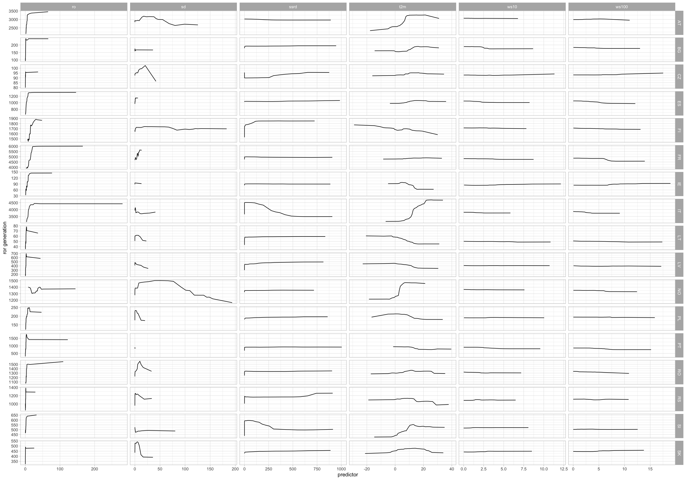
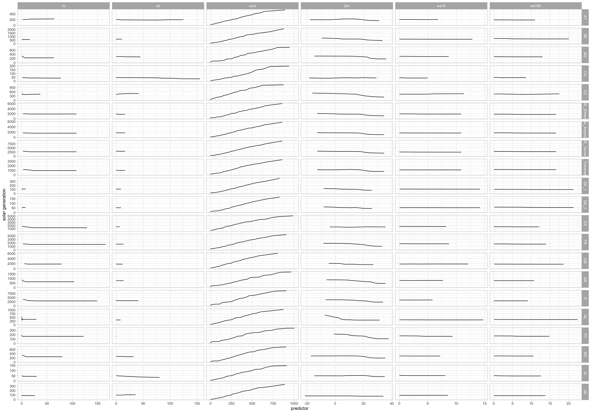
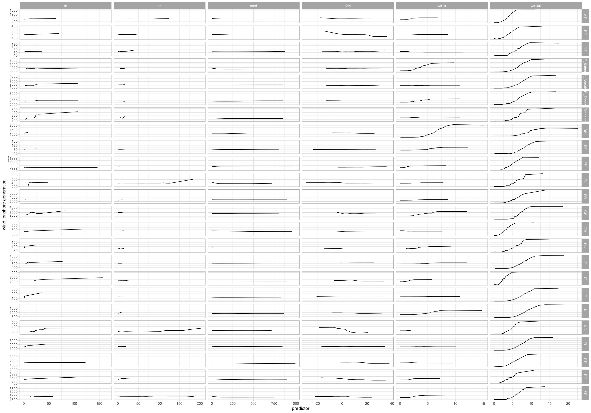

## Plotting the effects
This script create a plot with the responses calculate in the script
`05_analysis_response.R`


```r
library(tidyverse)
```

the `NUTS_LEVEL` sets the level
of spatial aggregation for the predictors (meteorological data from ERA-NUTS)


```r
NUTS_LEVEL <- "NUTS0"
```

Read the responses (a list) and merge everything into a single 
tibble and removes the negative values for the runoff


```r
responses <- read_rds(sprintf("responses-%s.rds", NUTS_LEVEL)) %>%
  bind_rows() %>%
  as_tibble() %>%
  dplyr::filter(!(str_sub(`_vname_`, 1, 2) == "ro" & (`_x_` < 0)))
```

For each target type: ror, solad and wind_onshore


```r
for (S in unique(responses$source)) {
  
  #' Load the responses  
  sel <- responses %>%
    as_tibble() %>%
    dplyr::filter(source == S) %>%
    rowwise() %>%
    mutate(type = str_split(`_vname_`, pattern = "_", simplify = TRUE)[1])
  #' Plot them using a faceted plot
  g <- ggplot(sel, aes(x = `_x_`, y = `_yhat_`, group = `_vname_`)) +
    geom_line() +
    facet_grid(area_name ~ type, scales = "free") +
    theme_light() +
    xlab('predictor') + ylab(sprintf('%s generation', S))
  print(g)
}
```



